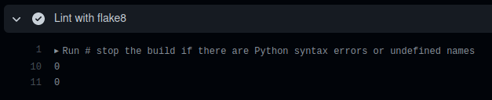
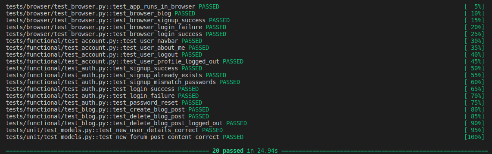
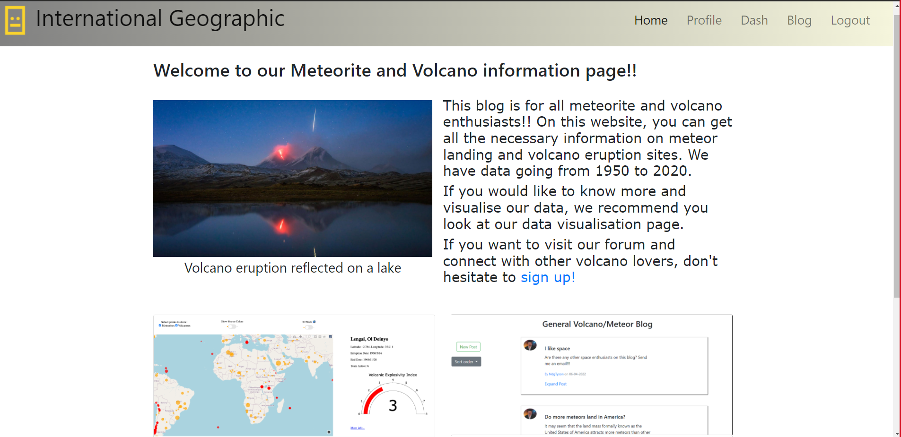
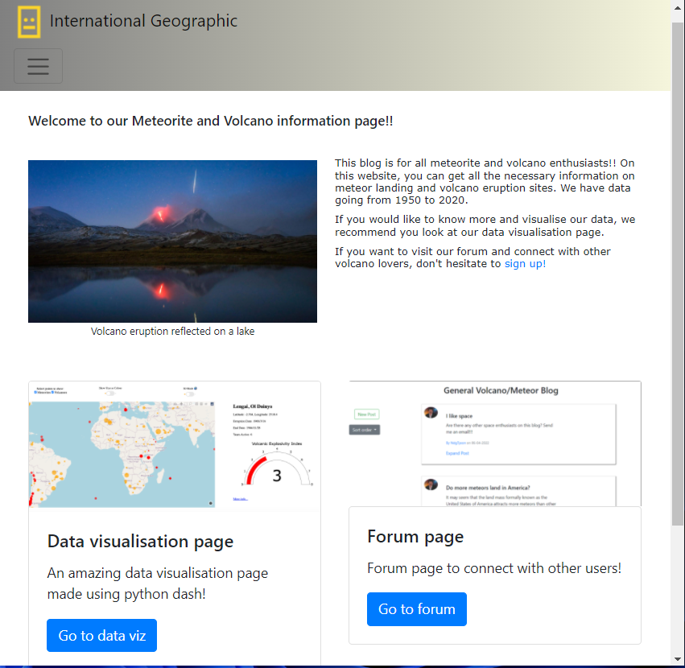

# **Coursework 2 Flask App for Volcanos and Meteorites**

[Repository URL](https://github.com/ucl-comp0035/comp0034-cw-group-14)


## **HOW TO RUN THE WEB APP** 

Enter the flask_project directory with:
```
cd flask_project
```
DASH MUST BE AT LEAST VERSION 2.1.0, THE APP WILL NOT WORK WITH 2.0.0.

The dash version can be checked using: 
```
pip show dash
```

You can specify the dash version in pip by running:
```
pip install dash==2.1.0
```
Run the [run.py](run.py) file to run the web app on [http://127.0.0.1:5000/ ](http://127.0.0.1:5000/ )

**Please make sure cookies are enabled in your browser for full functionality**

## **Features of the App**
All tabs utilise the same base template, complete with the app logo and a navigation bar containing the links to other tabs.

### Homepage
The homepage consists of an introductory message as well as two cards at the bottom of the page linking to the data visualisaton page as well as the forum. The homepage also features customisable advertisements which can only be editied by the admin. The admin is a user with the username "admin" and is logged into using the regular login page. Home displays a default advert which can be changed to a png uploaded from the computer using a button on the home page. There is also a delete advert button which removes the advert and then just shows the default image. The advert is put on the bottom of the page where it is not an eyesore but can still be easily visible.

Admin account email: admin@admin.com <br/>
Admin account password: password


### Signup, Login and Password Reset 
The signup/ register page requires the user to make an account for the platform, the details of which are stored in the database. The user must enter a username, first name, last name, email address, password and confirm their password. The username and email address must be unique as there cannot be two users with the same email address or username. Both the password and confirmed password must match and all fields must be completed before continuing. Having an account enables other features such as posting to the blog and creating a custom profile.  

After the user has created an account, they are given the option to sign in. The user's inputted details are checked against the database and if they are found then the user is logged in, giving them access to new features.   

If the user cannot remember their password, there is an option on the login page to reset your password after which the user enters their email address and will be sent a link to the reset page in which they can enter a new password. This is achieved using the flask_mail package. The user will only be sent an email, if an account already exists with the providied email. 

### Blog

Any user of the website can access the blog without an account. They can order the blog posts either by oldest or newest first. Individual posts can be expanded to reveal additional information about the user/post (full name and email). Once the user signs in, they can create a new post on the main blog page by using the 'new post' button. This post will automatically show on the blog page. Signing in also allows the user to press on the the username of a blog author and visit their profile page.


### Dash App Integration
The map/main page of the dash app from the previous coursework has been integrated as a route within the flask app as the flask app was the focus of this coursework. This tab can be accessed by anyone without logging in. The dash app includes a custom map which answers the following questions while being filtered by year of the volcanos or meteorites. 

- What are the locations of meteorite landing sites?  
- When did each meteorite land/ when was it found? 
- What is the mass distribution of the meteorites that landed?  
- Where do volcanoes occur?  
- How intensive were the eruptions of these volcanoes?
- Are historic volcano data points recorded in more specific areas of the world?  
- How long do volcanoes last for?  

The customisable visualisation allows users to see all of the volcano and meteorite locations in a dot map format and also allows them to filter the years in which the data in shown. When the user hovers over a given meteorite or volcano, all the information regarding the object is given in the hover menu as well as an indicator to the right of the map to show the mass or VEI of the meteorite or volcano respectively, as well as a link to a browser search where more information regarding a specific meteorite or volcano can be found.

### Profiles  
Accessing a user's profile can only be done once logged in, revealing the profile tab. Within the profile tab, the user can see information including, username, email, 'about me' and a profile picture. The user can upload a custom profile picture to their own profile page and write a short piece about themselves to be displayed when others visit their profile. One can only edit their own profile picture and about me information and these options do not appear when viewing someone else's profile. The user's blog posts are also displayed at the bottom of the page in order from newest to oldest.

## **Linting**
All python code has been linted with flake8, and set up automatically to run on GitHub.


## **Testing**
Testing has been done with pytest, and all tests are automatically running and passing on GitHub.
There are unit tests, functional and browser tests. The unit tests test classes defined in models.py and make sure that the classes are instantiated correctly.
```
test_new_user_details_correct()
test_new_forum_post_content_correct()
```
The functional tests test various different functionalities of the web app, such as creating a user account, signing in, creating blog posts, and editing a user profile. To aid writing the tests, a fixture has been used to clear the databse and create an instance of the flask app:
```
@pytest.fixture(scope="module")
def test_client():
    try:
        os.remove('flask_app/test.db')
    except FileNotFoundError:
        pass

    app = create_app(test=True)

    with app.test_client() as client:
        yield client
```
Once we have an instance of the client, we can pass this into each test to call functions such as `get()` and `post()`:
```
test_signup_success(test_client)
```
Another two fixtures were added which automatically create a default user in the database and another which creates a post. This is useful when testing other things that rely on there already being a user or post, such as creating/deleting posts or editing a profile.
```
@pytest.fixture(scope="module")
def test_client_with_user(test_client)

@pytest.fixture(scope="module")
def test_client_with_blog_post(test_client_with_user)
```
The browser tests use selinium to run a headless instance of Google Chrome and automate clicks and keyboard inputs to test the web app. Fixtures are used to run the Chrome driver as well as an instance of the application on a seperate process. A decorator is used to make sure the tests use the `run_app` fixture which creates an instance of the web app.
```
@pytest.mark.usefixtures('chrome_driver', 'run_app')
def test_app_runs_in_browser(chrome_driver)
```

All 20 tests are passing and running automatically on GitHub.


## Evidence of responsive design:






## Summary of additional features implemented from coursework brief list:

-	User profiles e.g. more extensive profile details with photos
-	Blog
-	Email integration e.g. password reset
-	Post adverts

